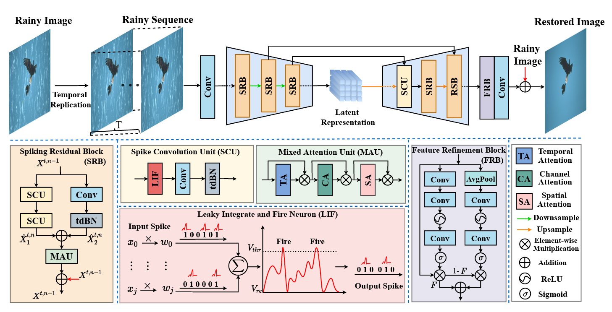

<!---
# Learning A Spiking Neural Network for Efficient Image Deraining
[](https://drive.google.com/drive/folders/1KRR_L276nviPT9JFPL9zfBiZVKJO6dM1?usp=drive_link)
[](https://pan.baidu.com/s/1TlgoslD-hIzySDL8l6gekw?pwd=pu2t)
--->
<div align="center">

# 【IJCAI'2024🔥】Learning A Spiking Neural Network for Efficient Image Deraining
</div>

> Learning A Spiking Neural Network for Efficient Image Deraining
> 
>  [Tianyu Song](https://scholar.google.com/citations?user=wA3Op6cAAAAJ&hl=zh-CN), Guiyue Jin, [Pengpeng Li](https://github.com/halamadrid-lpp),[Kui Jiang](https://homepage.hit.edu.cn/jiangkui), [Xiang Chen](https://cschenxiang.github.io/), Jiyu Jin
>
> Dalian Polytechnic University, Nanjing University of Science and Technology and Harbin Institute of Technology
>
> Primary contact: Tianyu Song(songtienyu@163.com)

> **Abstract:** 
Recently, spiking neural networks (SNNs) have demonstrated substantial potential in computer vision tasks.
In this paper, we present an Efficient Spiking Deraining Network, called ESDNet.
Our work is motivated by the observation that rain pixel values will lead to a more pronounced intensity of spike signals in SNNs. However, directly applying deep SNNs to image deraining task still remains a significant challenge.
This is attributed to the information loss and training difficulties that arise from discrete binary activation and complex spatio-temporal dynamics.
To this end, we develop a spiking residual block to convert the input into spike signals, then adaptively optimize the membrane potential by introducing attention weights to adjust spike responses in a data-driven manner, alleviating information loss caused by discrete binary activation.
By this way, our ESDNet can effectively detect and analyze the characteristics of rain streaks by learning their fluctuations. This also enables better guidance for the deraining process and facilitates high-quality image reconstruction.
Instead of relying on the ANN-SNN conversion strategy, we introduce a gradient proxy strategy to directly train the model for overcoming the challenge of training. 
Experimental results show that our approach gains comparable performance against ANN-based methods while reducing energy consumption by 54\%. 



<!---
## News

- **July 4, 2023:** Paper submitted. 
- **Sep 13, 2023:** The basic version is released, including codes, pre-trained models on the Sate 1k dataset, and the used dataset.
- **Sep 14, 2023:** RICE dataset updated.
  ** Sep 15, 2023:** The [visual results on Sate 1K](https://pan.baidu.com/s/1dToHnHI9GVaHQ3-I6OIbpA?pwd=rs1k) and [real-world dataset RSSD300](https://pan.baidu.com/s/1OZUWj8eo6EmP5Rh8DE1mrA?pwd=8ad5) are updated.-->


## Preparation

## Datasets
<table>
<thead>
  <tr>
    <th>Dataset</th>
    <th>Rain12</th>
    <th>Rain200L</th>
    <th>Rain200H</th>
    <th>Rain1200</th>
    <th>RW_Rain</th>
  </tr>
</thead>
<tbody>
  <tr>
    <td>Baidu Cloud</td>
    <td> <a href="https://pan.baidu.com/s/1mrXshB3Y0qO205aRR_lZaw?pwd=9ojl 提取码：9ojl">Download</a> </td>
    <td align="center"> <a href="https://pan.baidu.com/s/1wzvNW7UgLsSZbLd_lFfpyA?pwd=s6v0 提取码：s6v0 ">Download</a> </td>
    <td> <a href="https://pan.baidu.com/s/1pPF4CL7rvKRVvkVkJ0C8RA?pwd=k2iv 提取码：k2iv">Download</a> </td>
    <td> <a href="https://pan.baidu.com/s/1RlzbJa8XtCBUHXrJfxqiIQ?pwd=ajnz 提取码：ajnz">Download</a> </td>
    <td> <a href="https://pan.baidu.com/s/1GM85dkgxf8CyuwlhOV4e8Q?pwd=23vf 提取码：23vf">Download</a> </td>
  </tr>
</tbody>
</table>

## 🤖 Pre-trained Models
<table>
<thead>
  <tr>
    <th>Dataset</th>
    <th>Rain200L</th>
    <th>Rain200H</th>
    <th>Rain1200</th>
  </tr>
</thead>
<tbody>
  <tr>
    <td>Baidu Cloud</td>
    <td> <a href="https://pan.baidu.com/s/1Fzl0aHfGo2DoQdeJN7zIZQ?pwd=swq2 提取码：swq2">Download</a> </td>
    <td align="center"> <a href="https://pan.baidu.com/s/1Gp7bN2IU74EOSuIOr-duGg?pwd=4w57 提取码：4w57">Download</a> </td>
    <td > <a href="https://pan.baidu.com/s/1s6IybtRMsPF0dhEt2Z0sRQ?pwd=9d03 提取码：9d03">Download</a> </td>
  </tr>
</tbody>
</table>

### Install

We test the code on PyTorch 1.9.1 + CUDA 11.1 + cuDNN 8.0.5.

1. Create a new conda environment
```
conda create -n ESDNet python=3.8
conda activate ESDNet 
```

2. Install dependencies
```
pip install torch==1.9.1+cu111 torchvision==0.10.1+cu111 torchaudio==0.9.1 -f https://download.pytorch.org/whl/torch_stable.html

pip install matplotlib scikit-image opencv-python numpy einops math natsort tqdm lpips time tensorboardX
```

### Download

You can download the pre-trained models and datasets on BaiduPan.

The final file path should be the same as the following:

```
┬─ pretrained_models
│   ├─ Rain12.pth
│   ├─ Rain200H.pth
│   ├─ ... (model name)
│   └─ ... (exp name)
└─ data
    ├─ Rain200L
    ├─ Rain200H
    │├─ train
    ││  ├─ input
    ││  │  └─ ... (image filename)
    ││  │  └─ target
    ││  │  └─ ... (corresponds to the former)
    │└─ test
    │    └─ ...
    └─ ... (dataset name)

```
### 🛠️ Training, Testing and Evaluation

### Train
The training code will be released after the paper is accepted.
You should change the path to yours in the `Train.py` file.  Then run the following script to test the trained model:

```sh
python train.py
```

### Test
You should change the path to yours in the `Test.py` file.  Then run the following script to test the trained model:

```sh
python test.py
```


### Evaluation
You should change the path to yours in the `dataset_load.py` file.  Then run the following script to test the trained model:

```sh
python evaluation.py
```
It is recommended that you can download the visual deraining results and retest the quantitative results on your own device and environment.


### 🚀 Visual Results

<table>
<thead>
  <tr>
    <th>Dataset</th>
    <th>Rain12</th>
    <th>Rain200L</th>
    <th>Rain200H</th>
    <th>Rain1200</th>
    <th>RW_Rain</th>
  </tr>
</thead>
<tbody>
  <tr>
    <td>Baidu Cloud</td>
    <td> <a href="https://pan.baidu.com/s/1ch1H426nQGhRzHZDnF0NAA?pwd=khah 提取码：khah">Download</a> </td>
    <td align="center"> <a href="https://pan.baidu.com/s/12zgi3x8YY_ZPfI6sfGgMRQ?pwd=l5rn 提取码：l5rn">Download</a> </td>
    <td> <a href="https://pan.baidu.com/s/19TkwD-XzDAIp46145wmzpw?pwd=5uw9 提取码：5uw9">Download</a> </td>
    <td> <a href="https://pan.baidu.com/s/1xT7pMxESXcMnNL72ihbiuw?pwd=v9xc 提取码：v9xc">Download</a> </td>
    <td> <a href="https://pan.baidu.com/s/1rerYW9VbEweyaVvQpO7NAA?pwd=dt70 提取码：dt70">Download</a> </td>
  </tr>
</tbody>
</table>


## 🚨 Notes

1. Send e-mail to songtienyu@163.com if you have critical issues to be addressed.
2. Please note that there exists the slight gap in the final version due to errors caused by different testing devices and environments. 
3. Because the synthetic dataset is not realistic enough, the trained models may not work well on real world datasets.


## 👍 Acknowledgment

This code is based on the [Restormer](https://github.com/swz30/Restormer), [spikingjelly](https://github.com/fangwei123456/spikingjelly) and [C2PNet](https://github.com/YuZheng9/C2PNet). Thanks for their awesome work.
